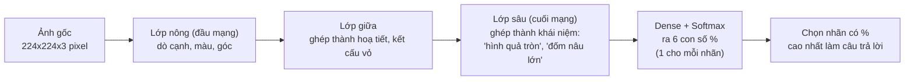
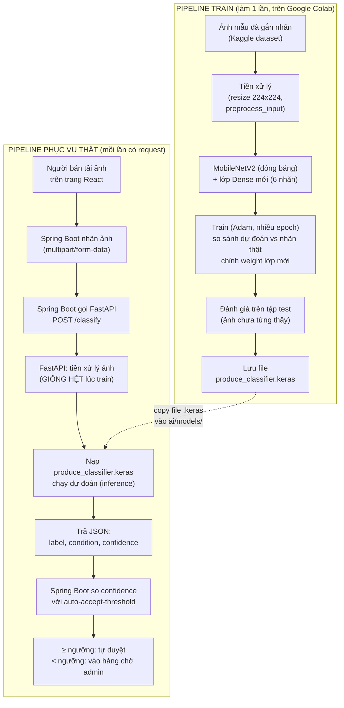

# Giải thích chi tiết phần AI — Phân loại chất lượng nông sản qua ảnh

Tài liệu này viết cho người **chưa từng học AI**. Đọc xong bạn sẽ hiểu: bài toán đang giải là gì, các
thuật ngữ nghĩa là gì, vì sao chọn MobileNetV2 (so với các lựa chọn khác), luồng chạy đầy đủ từ ảnh
thô đến kết quả trên web, và mỗi bước nằm ở file/dòng nào trong repo để tự tra cứu.

> Tài liệu song song: [`ai/README.md`](../README.md) là hướng dẫn **thao tác nhanh** (lệnh chạy cụ thể).
> File này là bản **giải thích khái niệm đầy đủ** — khi README nói "làm X" mà không rõ tại sao, quay lại đây.

## Mục lục

1. [Bài toán đang giải là gì](#1-bài-toán-đang-giải-là-gì)
2. [Từ điển thuật ngữ](#2-từ-điển-thuật-ngữ-tra-khi-gặp-từ-lạ)
3. [CNN — cách máy "nhìn" một tấm ảnh](#3-cnn--cách-máy-nhìn-một-tấm-ảnh)
4. [Transfer Learning là gì, vì sao bắt buộc phải dùng](#4-transfer-learning-là-gì-vì-sao-bắt-buộc-phải-dùng)
5. [MobileNetV2 là gì, cấu tạo bên trong](#5-mobilenetv2-là-gì-cấu-tạo-bên-trong)
6. [Vì sao chọn MobileNetV2 — so sánh có số liệu](#6-vì-sao-chọn-mobilenetv2--so-sánh-có-số-liệu)
7. [So sánh với các hướng giải pháp khác (ngoài CNN)](#7-so-sánh-với-các-hướng-giải-pháp-khác-ngoài-cnn)
8. [Pipeline đầy đủ: từ ảnh thô đến JSON trả về web](#8-pipeline-đầy-đủ-từ-ảnh-thô-đến-json-trả-về-web)
9. [Bản đồ: bước nào nằm ở file nào, dòng nào](#9-bản-đồ-bước-nào-nằm-ở-file-nào-dòng-nào)
10. [Cách cài đặt / chạy — tóm tắt](#10-cách-cài-đặt--chạy--tóm-tắt)
11. [Lỗi thường gặp & cách đọc log để tự sửa](#11-lỗi-thường-gặp--cách-đọc-log-để-tự-sửa)
12. [Tài liệu tham khảo chính thức](#12-tài-liệu-tham-khảo-chính-thức)

---

## 1. Bài toán đang giải là gì

**Input:** 1 tấm ảnh quả/rau người bán chụp và tải lên.
**Output:** 1 JSON gồm — loại nông sản (táo/chuối/cam...), tình trạng (tươi/hỏng), và **% tin cậy**
(model tự tin bao nhiêu % về câu trả lời đó).

Đây là bài toán **phân loại ảnh (image classification)**: đưa ảnh vào, model chọn 1 trong N nhãn đã
biết trước (N = 6 ở baseline: `fresh_apple, fresh_banana, fresh_orange, rotten_apple, rotten_banana,
rotten_orange`). Model **không** tự nghĩ ra nhãn mới — nó chỉ có thể trả lời bằng 1 trong các nhãn đã
được dạy lúc train.

Khác với lập trình thông thường (viết luật `if-else`), ở đây ta **không tự viết luật phân biệt "tươi vs
hỏng"** — vì đặc điểm ảnh thực tế quá đa dạng (góc chụp, ánh sáng, giống quả...) để liệt kê hết bằng
tay. Thay vào đó, ta cho máy xem **hàng nghìn ảnh mẫu đã gắn nhãn sẵn** (đây là ảnh táo tươi / đây là
ảnh táo hỏng), và một thuật toán học máy tự tìm ra quy luật phân biệt. Quá trình "tự tìm quy luật từ dữ
liệu mẫu" đó gọi là **huấn luyện (training)**.

## 2. Từ điển thuật ngữ (tra khi gặp từ lạ)

| Thuật ngữ | Giải thích dễ hiểu |
|---|---|
| **AI / Machine Learning (Học máy)** | Máy tự học quy luật từ dữ liệu mẫu, thay vì con người viết sẵn luật. |
| **Deep Learning (Học sâu)** | Một nhánh của Machine Learning, dùng **mạng nơ-ron nhiều lớp** (deep = nhiều lớp) để học. CNN nằm trong nhánh này. |
| **Neural Network (Mạng nơ-ron)** | Nhiều lớp tính toán xếp chồng lên nhau, mỗi lớp nhận đầu ra của lớp trước, biến đổi rồi đưa cho lớp sau. Lấy cảm hứng (rất thô) từ nơ-ron sinh học, nhưng bản chất chỉ là các phép nhân-cộng ma trận số. |
| **Layer (Lớp)** | 1 bước biến đổi trong mạng. Model của ta có hàng trăm lớp xếp chồng (xem mục 5). |
| **Weight / Parameter (Trọng số)** | Những con số bên trong mỗi lớp, quyết định lớp đó "tính toán" ra sao. Đây là thứ được **học/chỉnh sửa** trong lúc training — "train xong" nghĩa là các con số này đã được tối ưu để trả lời đúng. |
| **CNN (Convolutional Neural Network — Mạng nơ-ron tích chập)** | Loại mạng nơ-ron chuyên xử lý ảnh, dùng phép toán "tích chập" (convolution) để quét ảnh tìm đặc điểm. Giải thích kỹ ở [mục 3](#3-cnn--cách-máy-nhìn-một-tấm-ảnh). |
| **Convolution / Filter / Kernel** | Một "cửa sổ" nhỏ (ví dụ 3×3 pixel) trượt qua toàn bộ ảnh để dò 1 đặc điểm cụ thể (VD: 1 filter dò cạnh dọc, 1 filter khác dò màu nâu). |
| **Feature map** | Kết quả sau khi 1 filter quét xong toàn bộ ảnh — 1 "bản đồ" cho biết đặc điểm đó xuất hiện đậm/nhạt ở đâu trên ảnh. |
| **Pooling** | Bước thu nhỏ feature map (VD giữ giá trị lớn nhất trong mỗi vùng 2×2) để giảm khối lượng tính toán và làm model bớt nhạy với việc vật thể lệch vài pixel. |
| **Fully Connected / Dense layer** | Lớp "tổng hợp" ở gần cuối mạng, gộp toàn bộ đặc điểm đã dò được lại để đưa ra quyết định cuối cùng (thuộc lớp nào). |
| **Activation function** | Hàm "phi tuyến" chèn giữa các lớp để mạng học được quy luật phức tạp (không chỉ đường thẳng). Hay dùng: **ReLU** (giữa mạng), **Softmax** (lớp cuối, biến điểm số thành % xác suất cộng lại = 100%). |
| **Loss function (hàm mất mát)** | Thước đo "model đang sai bao nhiêu" so với nhãn thật, tính sau mỗi lần dự đoán lúc train. Train = tìm cách chỉnh weight để loss càng nhỏ càng tốt. Ở đây dùng `categorical_crossentropy` (chuẩn cho phân loại nhiều lớp). |
| **Optimizer** | Thuật toán chỉnh weight để giảm loss (ở đây dùng **Adam**, phổ biến nhất hiện nay). |
| **Epoch** | 1 lượt cho model xem **hết toàn bộ** ảnh train 1 lần. Train nhiều epoch = cho xem đi xem lại nhiều lần để học sâu hơn (nhưng quá nhiều sẽ gây overfitting — xem bên dưới). |
| **Batch / Batch size** | Thay vì học từng ảnh 1 (chậm) hay học hết cả tập cùng lúc (tốn bộ nhớ), model xử lý theo từng "lô" nhỏ. `BATCH_SIZE = 32` nghĩa là mỗi lần chỉnh weight dựa trên 32 ảnh. |
| **Learning rate** | Mỗi lần chỉnh weight thì chỉnh "mạnh tay" hay "nhẹ tay". Quá lớn → học loạn không hội tụ; quá nhỏ → học cực chậm. Notebook dùng `1e-3` (0.001) lúc đầu, `1e-5` lúc fine-tune (nhẹ tay hơn 100 lần). |
| **Overfitting (học vẹt)** | Model "học thuộc lòng" đúng y hệt ảnh train (kể cả nhiễu, ánh sáng riêng biệt của bộ ảnh đó) thay vì học quy luật tổng quát → làm rất tốt trên ảnh train nhưng đoán sai be bét với ảnh mới. Cách chống: Dropout, Data Augmentation, dùng ít epoch hơn, theo dõi độ chính xác trên tập test (ảnh model chưa từng thấy). |
| **Data Augmentation** | Biến đổi ngẫu nhiên ảnh train (lật ngang, xoay nhẹ...) để tạo thêm "biến thể", giúp model không học vẹt theo góc chụp cố định. |
| **Dropout** | Lúc train, ngẫu nhiên "tắt" bớt 1 số nơ-ron mỗi lượt — ép model không phụ thuộc quá nhiều vào 1 vài đặc điểm, giảm overfitting. |
| **Pretrained model (model đã huấn luyện sẵn)** | Model người khác đã tốn công train sẵn trên bộ dữ liệu khổng lồ, cho tải về dùng lại miễn phí. Ở đây dùng bản MobileNetV2 đã train sẵn trên **ImageNet**. |
| **ImageNet** | Bộ dữ liệu ảnh khổng lồ (~14 triệu ảnh, 1000 loại vật thể khác nhau: chó, mèo, xe, quả táo...) dùng làm chuẩn "sát hạch" cho gần như mọi model ảnh hiện nay. Model train trên ImageNet đã "biết nhìn" hình dạng/màu sắc/kết cấu nói chung. |
| **Transfer Learning (học chuyển giao)** | Tận dụng 1 pretrained model, chỉ dạy thêm phần cuối cho bài toán riêng của mình thay vì train lại từ đầu. Xem [mục 4](#4-transfer-learning-là-gì-vì-sao-bắt-buộc-phải-dùng). |
| **Freeze / Unfreeze layer (đóng băng lớp)** | "Đóng băng" = khoá không cho lớp đó thay đổi weight lúc train (giữ nguyên kiến thức đã học từ ImageNet). "Mở khoá" (unfreeze) = cho phép chỉnh lại — dùng ở bước fine-tune. |
| **Fine-tuning** | Sau khi train phần mới thêm vào đã ổn, mở khoá thêm vài lớp cuối của phần pretrained để tinh chỉnh sâu hơn cho đúng bài toán của mình (dùng learning rate rất nhỏ để không phá vỡ kiến thức cũ). |
| **Inference (suy luận / dự đoán)** | Lúc **dùng** model đã train xong để đoán ảnh mới (khác với lúc **train**). Đây là việc FastAPI làm mỗi khi nhận ảnh từ backend. |
| **Confidence (độ tin cậy) / Probability** | Con số 0–1 (hoặc 0–100%) thể hiện model tự tin bao nhiêu về câu trả lời nó chọn. Vì lớp cuối dùng Softmax, tổng % của tất cả các nhãn luôn = 100%. |
| **Label / Class (nhãn / lớp)** | 1 phạm trù model có thể trả lời, VD `fresh_apple`. Có bao nhiêu nhãn thì lớp Dense cuối có bấy nhiêu "ô output". |
| **Accuracy (độ chính xác)** | % số ảnh model đoán đúng trên 1 tập ảnh cho trước. Luôn phải xem trên **tập test** (ảnh model chưa từng thấy lúc train) — xem trên tập train sẽ bị "ảo tưởng" cao hơn thực tế. |
| **Train set / Test set (Validation set)** | Train set = ảnh dùng để dạy model. Test set = ảnh **tách riêng**, không đưa cho model học, chỉ dùng để kiểm tra thật sự nó giỏi tới đâu. |
| **GPU / CPU** | GPU (Graphics Processing Unit) tính toán song song rất nhanh, phù hợp train mạng nơ-ron (nhanh hơn CPU hàng chục lần). Google Colab cho mượn GPU miễn phí — đây là lý do ta train ở Colab thay vì máy cá nhân. |
| **Tensor** | Cách TensorFlow/Keras biểu diễn dữ liệu số (ảnh, weight...) dưới dạng mảng nhiều chiều. Không cần hiểu sâu — chỉ cần biết mọi thứ trong Keras đều là Tensor. |
| **API / REST API** | Cách 2 chương trình (VD Spring Boot và FastAPI) giao tiếp qua HTTP, gửi/nhận dữ liệu dạng JSON. Xem thêm quy ước ở `CLAUDE.md` mục 7. |
| **FastAPI** | Framework Python để viết REST API nhanh, có sẵn trang test tự động tại `/docs`. Đây là thứ "khoác áo" cho model, biến nó từ 1 file `.keras` thành 1 dịch vụ nhận ảnh qua mạng và trả JSON. |
| **`.keras` file (model checkpoint)** | File chứa toàn bộ kiến trúc mạng + weight đã học được, có thể nạp lại để dùng dự đoán mà không cần train lại. |

## 3. CNN — cách máy "nhìn" một tấm ảnh

Với máy tính, 1 tấm ảnh chỉ là 1 lưới số (mỗi pixel = 3 số Đỏ-Xanh lá-Xanh dương, 0–255). CNN xử lý
lưới số đó qua nhiều lớp, mỗi lớp học một mức đặc điểm sâu hơn lớp trước:



Điểm mấu chốt: **không ai lập trình sẵn "lớp nông tìm cạnh"** — toàn bộ filter ở mỗi lớp được **tự học**
từ dữ liệu train (qua việc tối ưu Loss function bằng Optimizer, lặp qua nhiều Epoch). Ta chỉ thiết kế
*hình dạng* của mạng (bao nhiêu lớp, mỗi lớp làm gì), còn *nội dung* các filter đó do quá trình train tự
tìm ra.

## 4. Transfer Learning là gì, vì sao bắt buộc phải dùng

**Vấn đề:** để CNN tự học "biết nhìn" từ đầu (random weight ban đầu, chưa biết gì) thường cần **hàng
trăm nghìn đến hàng triệu ảnh** và **nhiều ngày train trên GPU mạnh**. Đồ án 10 tuần, dataset baseline
chỉ vài nghìn ảnh → train từ đầu gần như chắc chắn thất bại (model sẽ đoán lung tung hoặc học vẹt).

**Giải pháp — Transfer Learning:** dùng lại 1 model đã được người khác train sẵn trên ImageNet (14
triệu ảnh, 1000 loại vật thể) — model này **đã biết nhìn hình dạng, màu sắc, kết cấu nói chung** rồi
(biết phân biệt "tròn vs dài", "đỏ vs nâu", "trơn láng vs sần sùi"...). Ta chỉ cần:

1. **Đóng băng** gần như toàn bộ phần đã biết nhìn đó (giữ nguyên weight, không train lại).
2. **Thay lớp cuối cùng** bằng 1 lớp Dense mới, số ô = số nhãn của ta (6 nhãn), weight ngẫu nhiên.
3. **Chỉ train phần mới thêm vào** — dạy nó cách map "những gì đã nhìn thấy" sang 6 nhãn của mình.

Ví dụ dễ hình dung: thay vì dạy một người biết nhìn từ số 0 (mất nhiều năm), ta thuê một người **đã biết
nhìn và phân biệt hàng nghìn loại vật thể sẵn**, rồi chỉ **dạy thêm** người đó cách phân biệt "táo tươi
vs táo hỏng". Việc dạy thêm chỉ cần vài nghìn ảnh và vài chục phút trên GPU miễn phí, thay vì hàng trăm
nghìn ảnh và hàng ngày.

Sau khi phần mới đã ổn, có thể làm thêm **Fine-tuning**: mở khoá vài lớp cuối cùng của phần pretrained,
train tiếp với learning rate rất nhỏ để tinh chỉnh sâu hơn — như việc "điều chỉnh nhẹ" thay vì "dạy lại
từ đầu", vì nếu learning rate lớn sẽ phá mất kiến thức cũ quý giá.

## 5. MobileNetV2 là gì, cấu tạo bên trong

**MobileNetV2** là 1 kiến trúc CNN do nhóm nghiên cứu Google công bố năm 2018, thiết kế **chuyên để
chạy nhẹ, nhanh** trên thiết bị yếu (điện thoại, IoT) mà vẫn giữ độ chính xác gần bằng các mạng nặng
hơn nhiều. Bài báo gốc: *"MobileNetV2: Inverted Residuals and Linear Bottlenecks"* — Sandler, Howard,
Zhu, Zhmoginov, Chen (Google, CVPR 2018).

2 ý tưởng cốt lõi làm nó nhẹ hơn hẳn CNN truyền thống (không cần hiểu công thức toán, chỉ cần hiểu ý
tưởng):

- **Depthwise Separable Convolution** — Convolution thông thường quét toàn bộ 3 kênh màu (R,G,B) và
  toàn bộ bộ lọc cùng lúc trong 1 phép toán lớn (rất tốn phép nhân). MobileNetV2 **tách làm 2 bước nhỏ
  hơn**: (1) quét từng kênh màu riêng lẻ, (2) rồi mới trộn kết quả các kênh lại bằng 1 phép toán đơn
  giản (1×1). Tách nhỏ như vậy giảm số phép tính đi **8–9 lần** so với convolution truyền thống, mà kết
  quả gần tương đương.
- **Inverted Residual + Linear Bottleneck** — Ở mỗi khối xử lý, mạng "phình to" số kênh dữ liệu ra tạm
  thời để dễ trích đặc điểm phong phú, rồi "nén lại" nhỏ gọn trước khi đưa sang khối tiếp theo (ngược
  với cách làm truyền thống là nén trước phình sau — do đó có tên "Inverted" = đảo ngược). Cách này giữ
  được lượng thông tin cần thiết mà vẫn tiết kiệm bộ nhớ giữa các lớp.

Kết quả: MobileNetV2 chỉ nặng **14MB, 3.5 triệu tham số**, chạy được cả trên CPU máy tính thường hoặc
điện thoại, phù hợp để nhúng vào 1 dịch vụ FastAPI nhỏ chạy cùng backend — không cần server có GPU lúc
phục vụ thật (GPU chỉ cần lúc **train**, không cần lúc **inference**/dùng thật với model đã nhẹ như thế
này).

## 6. Vì sao chọn MobileNetV2 — so sánh có số liệu

Số liệu chính thức từ Keras Applications (`keras.io/api/applications`, đánh giá trên tập validation của
ImageNet — cùng 1 chuẩn cho mọi model nên so sánh công bằng):

| Model | Kích thước file | Top-1 Accuracy | Số tham số | Nhận xét |
|---|---|---|---|---|
| **MobileNetV2** ✅ (đang dùng) | **14 MB** | 71.3% | **3.5 triệu** | Nhẹ nhất bảng, đủ chính xác |
| MobileNet (v1) | 16 MB | 70.4% | 4.3 triệu | Bản cũ hơn, MobileNetV2 vượt trội hơn cả 2 mặt |
| VGG16 | 528 MB | 71.3% | 138.4 triệu | **Chính xác bằng MobileNetV2 nhưng nặng gấp 37 lần** |
| VGG19 | 549 MB | 71.3% | 143.7 triệu | Tương tự VGG16, càng nặng hơn |
| ResNet50 | 98 MB | 74.9% | 25.6 triệu | Chính xác hơn ~3.6%, nặng gấp 7 lần, chậm hơn đáng kể |
| ResNet50V2 | 98 MB | 76.0% | 25.6 triệu | Tương tự ResNet50 |
| InceptionV3 | 92 MB | 77.9% | 23.9 triệu | Chính xác hơn ~6.6%, nặng gấp 6.5 lần |
| Xception | 88 MB | 79.0% | 22.9 triệu | Chính xác nhất bảng nhưng nặng gấp 6 lần |
| EfficientNetB0 | 29 MB | 77.1% | 5.3 triệu | Đối thủ gần nhất — nhẹ, khá chính xác, xem phân tích dưới |
| NASNetMobile | 23 MB | 74.4% | 5.3 triệu | Kiến trúc do AI tự tìm ra (Neural Architecture Search), phức tạp hơn khi tuỳ biến |

**Kết luận thực tế cho đồ án:**

- So với VGG16/19: MobileNetV2 **chính xác bằng nhau** (71.3%) nhưng **nhẹ hơn 37 lần** → không có lý
  do gì dùng VGG cho bài toán này.
- So với ResNet50/InceptionV3/Xception: các model này chính xác hơn khoảng 3.6–7.7 điểm % trên **1000
  loại vật thể tổng quát của ImageNet** — nhưng bài toán của ta chỉ có **6 lớp** (ít và dễ phân biệt hơn
  nhiều: táo tròn đỏ khác hẳn chuối dài vàng), nên với transfer learning, khoảng cách chính xác thực tế
  giữa các model này trên bài toán CỦA TA sẽ nhỏ hơn nhiều so với con số 1000-lớp ở trên — trong khi chi
  phí (thời gian train mỗi epoch, dung lượng server) cao hơn hẳn. Đổi lấy vài % chính xác không đáng so
  với việc backend/FastAPI phải cõng 1 file model nặng gấp 6-7 lần.
- **EfficientNetB0 là đối thủ đáng cân nhắc nhất** (chính xác hơn MobileNetV2 ~5.8 điểm %, chỉ nặng hơn
  2 lần) — nếu sau này (tuần 6, thêm rau củ) độ chính xác MobileNetV2 không đủ tốt, đây là lựa chọn nâng
  cấp hợp lý tiếp theo (chỉ cần đổi 1 dòng `tf.keras.applications.MobileNetV2` thành
  `tf.keras.applications.EfficientNetB0` trong notebook, kiến trúc code xung quanh giữ nguyên).
- MobileNetV2 còn có lợi thế thêm: được thiết kế **riêng cho thiết bị yếu**, tài liệu/tutorial nhiều
  nhất (dễ tìm hướng dẫn khi bí), và được dùng cực phổ biến trong chính các đồ án/bài báo về "phân loại
  trái cây tươi/hỏng" — tức đã được cộng đồng kiểm chứng phù hợp với đúng loại bài toán này.

## 7. So sánh với các hướng giải pháp khác (ngoài CNN)

Ngoài việc chọn *kiến trúc CNN nào*, còn có những *hướng giải pháp hoàn toàn khác* để giải bài toán này
— dưới đây là lý do loại các hướng đó cho phạm vi đồ án hiện tại:

| Hướng giải pháp | Ưu điểm | Nhược điểm | Kết luận |
|---|---|---|---|
| **Transfer Learning CNN (đang dùng)** | Tự chủ, miễn phí, nhẹ, phù hợp thời gian đồ án | Cần tự train, độ chính xác phụ thuộc dataset | ✅ Chọn |
| **Cloud Vision API** (Google Cloud Vision, Azure Custom Vision, AWS Rekognition Custom Labels) | Không cần tự train, chỉ gọi API có sẵn, độ chính xác cao ngay | Tốn phí theo lượng ảnh, phụ thuộc bên thứ 3 (mất mạng/hết hạn free tier là hỏng demo), khó giải thích "nhóm tự làm AI" khi bảo vệ đồ án — hội đồng thường hỏi sâu về model | ❌ Không phù hợp đồ án tốt nghiệp |
| **Object Detection (YOLO, Faster R-CNN...)** | Không chỉ phân loại mà còn khoanh vùng chính xác vết hỏng/đốm nâu trên ảnh (bounding box) | Cần dataset gắn nhãn phức tạp hơn nhiều (phải vẽ khung toạ độ từng vết hỏng, không chỉ dán nhãn cả ảnh), độ khó triển khai cao hơn hẳn, không cần thiết cho yêu cầu hiện tại (chỉ cần biết "hỏng hay không", chưa cần biết "hỏng ở đâu trên ảnh") | ⏸ Có thể cân nhắc nếu đồ án muốn nâng cấp tính năng ở giai đoạn sau, không phải bây giờ |
| **Vision Transformer (ViT)** | Kiến trúc hiện đại nhất (2020+), độ chính xác cao nhất trên nhiều bài toán khi có đủ dữ liệu | Cần dataset RẤT lớn để phát huy hết sức mạnh (yếu thế hơn CNN khi ít dữ liệu như trường hợp của ta), nặng hơn, khó giải thích trực quan trong báo cáo đồ án | ❌ Overkill cho quy mô dataset hiện tại |
| **Model hồi quy điểm số 0-100 (Regression)** | Cho điểm liên tục sát thực tế hơn thay vì chỉ 2 trạng thái tươi/hỏng | Gần như không có dataset công khai gắn sẵn điểm số liên tục cho nông sản — phải tự gắn nhãn thủ công hàng nghìn ảnh, cực tốn công | ❌ Đã quyết định dùng confidence của phân loại thay thế (xem mục 8) |

## 8. Pipeline đầy đủ: từ ảnh thô đến JSON trả về web

Có **2 pipeline khác nhau**, đừng nhầm lẫn: 1 lần train (làm 1 lần, offline, trên Colab) và mỗi lần
inference (chạy lại mỗi khi có người bán đăng ảnh, trên FastAPI).



Điểm **cực kỳ quan trọng**: bước tiền xử lý ảnh ở pipeline Train (A2) và pipeline Serve (B4) **phải
giống hệt nhau tuyệt đối** (cùng resize về 224×224, cùng dùng `mobilenet_v2.preprocess_input`). Nếu
lệch — model vẫn chạy bình thường, không báo lỗi gì, nhưng **đoán sai gần như ngẫu nhiên** dù vẫn hiển
thị "% tin cậy" cao trông có vẻ đáng tin — đây là lỗi khó phát hiện nhất khi làm AI, vì hệ thống trông
như hoạt động bình thường.

## 9. Bản đồ: bước nào nằm ở file nào, dòng nào

| Bước | Pipeline | Vị trí trong repo |
|---|---|---|
| Tải dataset Kaggle | Train | `ai/notebooks/01_train_baseline_mobilenetv2.ipynb` — "Buoc 1" |
| Xem cấu trúc thư mục thật | Train | notebook — "Buoc 2" |
| Nạp ảnh thành `train_ds`/`test_ds`, lấy `class_names` | Train | notebook — "Buoc 3" |
| Tiền xử lý (`preprocess_input`) | Train | notebook — "Buoc 4" |
| Dựng model (MobileNetV2 + đóng băng + lớp Dense mới) | Train | notebook — "Buoc 5" |
| Train giai đoạn 1 (`model.fit`, 10 epoch) | Train | notebook — "Buoc 6" |
| Fine-tune (mở khoá lớp cuối, learning rate nhỏ) | Train | notebook — "Buoc 7" (tuỳ chọn) |
| Đánh giá accuracy trên test set | Train | notebook — "Buoc 8" |
| Lưu + tải file `.keras`, in `LABELS` | Train | notebook — "Buoc 9" |
| Danh sách nhãn (`LABELS`), thứ tự phải khớp notebook | Serve | [`ai/app/classifier.py`](../app/classifier.py) — hằng số `LABELS` |
| Nạp model từ file `.keras` | Serve | `ai/app/classifier.py` — `ProduceClassifier.__init__` |
| Tiền xử lý ảnh khi phục vụ thật (phải khớp Bước train #4) | Serve | `ai/app/classifier.py` — `_preprocess()` |
| Dự đoán + trả kết quả (kể cả chế độ mock khi chưa có model) | Serve | `ai/app/classifier.py` — `predict()` |
| Endpoint HTTP `POST /classify`, `GET /health` | Serve | [`ai/app/main.py`](../app/main.py) |
| Ngưỡng tự-duyệt / hàng chờ admin (`auto-accept-threshold`) | Tích hợp | `backend/src/main/resources/application.properties` — `app.ai.auto-accept-threshold` |
| Backend gọi sang AI service (chưa code, làm ở tuần 5) | Tích hợp | sẽ nằm trong `backend/.../service/` theo `CLAUDE.md` mục 5 |

## 10. Cách cài đặt / chạy — tóm tắt

Chi tiết từng lệnh nằm ở [`ai/README.md`](../README.md); tóm tắt luồng ở đây để thấy bức tranh tổng thể:

1. **Train (1 lần, trên Colab, không cần cài gì trên máy):** mở notebook bằng Google Colab → bật GPU →
   chạy từng ô → tải về file `produce_classifier.keras`.
2. **Đưa model vào repo:** copy file đó vào `ai/models/produce_classifier.keras` (thư mục đã gitignore
   vì file nặng — chia sẻ qua Drive cho cả nhóm, không push lên Git).
3. **Đồng bộ nhãn:** copy đúng danh sách `class_names` notebook in ra, dán vào `LABELS` trong
   `ai/app/classifier.py`.
4. **Cài môi trường Python cục bộ (chỉ máy chạy AI service cần):**
   ```bash
   cd ai
   python -m venv .venv
   .venv\Scripts\activate        # Windows (Mac/Linux: source .venv/bin/activate)
   pip install -r requirements-model.txt   # có TensorFlow, nặng ~500MB
   ```
5. **Chạy service:** `uvicorn app.main:app --reload --port 8000` → mở `http://localhost:8000/docs` để
   test thử (kéo thả ảnh vào `POST /classify`), `GET /health` phải báo `"model_loaded": true`.
6. Nếu **chưa có model** (bỏ qua bước 1-3), service vẫn chạy được ở **chế độ mock** — trả kết quả giả
   lập ổn định theo hash ảnh, để backend/frontend dev không bị chặn tiến độ trong lúc chờ model thật.

## 11. Lỗi thường gặp & cách đọc log để tự sửa

| Log / hiện tượng | Nguyên nhân | Cách sửa |
|---|---|---|
| `GET /health` báo `"model_loaded": false` dù đã copy file | Sai đường dẫn — mặc định server tìm ở `models/produce_classifier.keras` **tính từ nơi chạy lệnh `uvicorn`** (tức trong thư mục `ai/`) | Kiểm tra file nằm đúng `ai/models/produce_classifier.keras`, hoặc set biến môi trường `MODEL_PATH` trỏ đúng đường dẫn tuyệt đối |
| Model chạy, không lỗi, nhưng đoán sai gần hết mọi ảnh dù "% tin cậy" vẫn cao | 90% là do **LABELS sai thứ tự** hoặc **tiền xử lý lệch** giữa train và serve (xem mục 8) | Đối chiếu lại `LABELS` trong `classifier.py` với `class_names` notebook in ra lúc train; kiểm tra cả 2 nơi đều dùng `mobilenet_v2.preprocess_input` |
| Colab báo `ResourceExhaustedError` / hết bộ nhớ GPU | `BATCH_SIZE` quá lớn so với RAM GPU miễn phí của Colab | Giảm `BATCH_SIZE` (32 → 16), hoặc Runtime > Restart runtime rồi chạy lại từ đầu |
| Notebook báo không tìm thấy thư mục `TRAIN_DIR`/`TEST_DIR` | Tên thư mục Kaggle giải nén ra khác với giả định trong notebook | Chạy lại ô "Buoc 2" (in cây thư mục), copy đúng đường dẫn thật vào 2 biến ở "Buoc 3" |
| `pip install -r requirements-model.txt` rất lâu / nặng | TensorFlow là thư viện ~500MB | Bình thường, chỉ cần cài 1 lần; nếu máy yếu, cân nhắc chỉ chạy chế độ mock trên máy đó và để máy khác (mạnh hơn) chạy model thật |
| Cổng `8000` bị chiếm khi chạy `uvicorn` | Có tiến trình FastAPI cũ vẫn đang chạy | Tắt tiến trình cũ, hoặc đổi cổng: `uvicorn app.main:app --port 8001` (nhớ đổi luôn `AI_SERVICE_URL` phía backend) |

## 12. Tài liệu tham khảo chính thức

- Bài báo gốc MobileNetV2: Sandler et al., *"MobileNetV2: Inverted Residuals and Linear Bottlenecks"*,
  CVPR 2018 — https://arxiv.org/abs/1801.04381
- Bảng so sánh model chính thức của Keras (nguồn số liệu mục 6) — https://keras.io/api/applications/
- Hướng dẫn Transfer Learning chính thức của TensorFlow — https://www.tensorflow.org/guide/keras/transfer_learning
- Dataset dùng làm baseline — https://www.kaggle.com/datasets/sriramr/fruits-fresh-and-rotten-for-classification
- Tài liệu FastAPI (framework phục vụ model) — https://fastapi.tiangolo.com/
- Tài liệu `tf.keras.utils.image_dataset_from_directory` (cách notebook nạp ảnh) —
  https://www.tensorflow.org/api_docs/python/tf/keras/utils/image_dataset_from_directory
